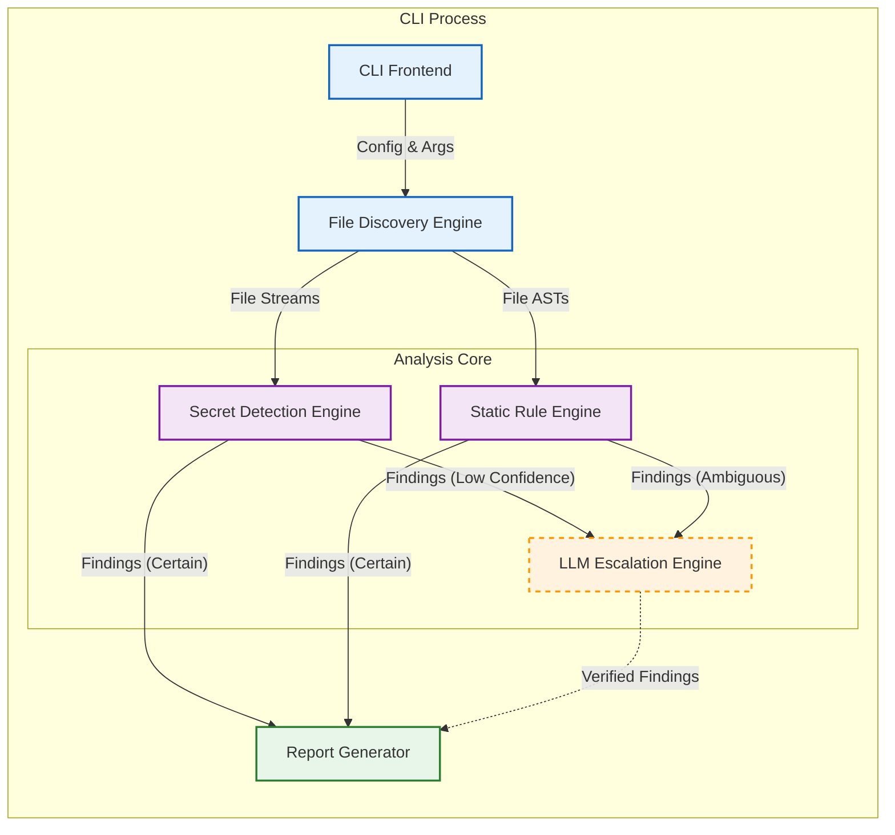

# Internal Architecture Design: VibeSec CLI

## 1. Architectural Principles
*   **Stateless Execution**: The process runs to completion and exits. No long-lived state (unlike a server).
*   **Determinism First**: Heuristic components (LLM) are strictly optional and must never override a deterministic BLOCK verdict.
*   **IO Segregation**: File IO is restricted to the Discovery Engine. Analysis engines operate on in-memory content.

## 2. Component Diagram

## 3. Component Responsibilities

### A. Core Pipeline (Deterministic)

| Component | Responsibility | Inputs | Outputs | Nature |
| :--- | :--- | :--- | :--- | :--- |
| **CLI Frontend** | Entrypoint. Parses args (`--strict`), loads `vibesec.json`, and validates environment. | `argv`, `env` | `ConfigObject` | Deterministic |
| **File Discovery Engine** | Crawls filesystem, respects `.gitignore`, identifies file types, handles concurrency. | `Config`, `RootPath` | `FileStream` / `AST` | Deterministic |
| **Secret Detection Engine** | Scans content strings for high-entropy tokens and regex patterns (AWS, Stripe, etc.). | `String` | `Finding[]` | Deterministic |
| **Static Rule Engine** | Walks AST to validate security best practices (e.g., "Helmet middleware missing"). | `AST` | `Finding[]` | Deterministic |
| **Report Generator** | Aggregates results, deduplicates, filters suppressions, and renders JSON/Text. | `Finding[]` | `Stdout` | Deterministic |

### B. Escalation Path (Heuristic)

| Component | Responsibility | Inputs | Outputs | Nature |
| :--- | :--- | :--- | :--- | :--- |
| **LLM Escalation Engine** | *Optional*. resolving "Maybe" findings. Sends snippets to external LLM for classification. | `Snippet`, `Context` | `Verdict` (FP/TP) | **Heuristic** |

## 4. Deterministic vs. Heuristic Separation
*   **Default Path**: The CLI runs purely deterministically. Findings are binary (Pass/Fail).
*   **Escalation Path** (Flag `--ai`): Only findings marked `CONFIDENCE_LOW` by deterministic engines are candidates for the LLM.
*   **Rule**: The LLM can **dismiss** a low-confidence finding (reduce noise) but cannot **overrule** a high-confidence finding.

## 5. Mapping: Old Runtime vs New CLI Components

| Old Runtime Component | Status | New CLI Equivalent | Rationale |
| :--- | :--- | :--- | :--- |
| **Middleware Orchestrator** | **Removed** | **CLI Frontend** | Orchestration moves from "Request Chain" to "Analysis Pipeline". |
| **Request Guard** | **Removed** | **Static Rule Engine** | We check *code patterns* (AST), not *live requests*. |
| **Rate Limiter** | **Removed** | *None* | Runtime traffic control is out of scope for static analysis. |
| **Input Validator** | **Refactored** | **Static Rule Engine** | Instead of validating data, we check if *Validation Middleware* exists in code. |
| **Header Factory** | **Refactored** | **Static Rule Engine** | Instead of injecting headers, we check if code *sets* headers. |
| **Telemetry Emitter** | **Refactored** | **Report Generator** | "Logs" become "Scan Reports". |
| **Config Loader** | **Kept** | **CLI Frontend** | Config loading (files/env) is still required but fails fast on error. |
