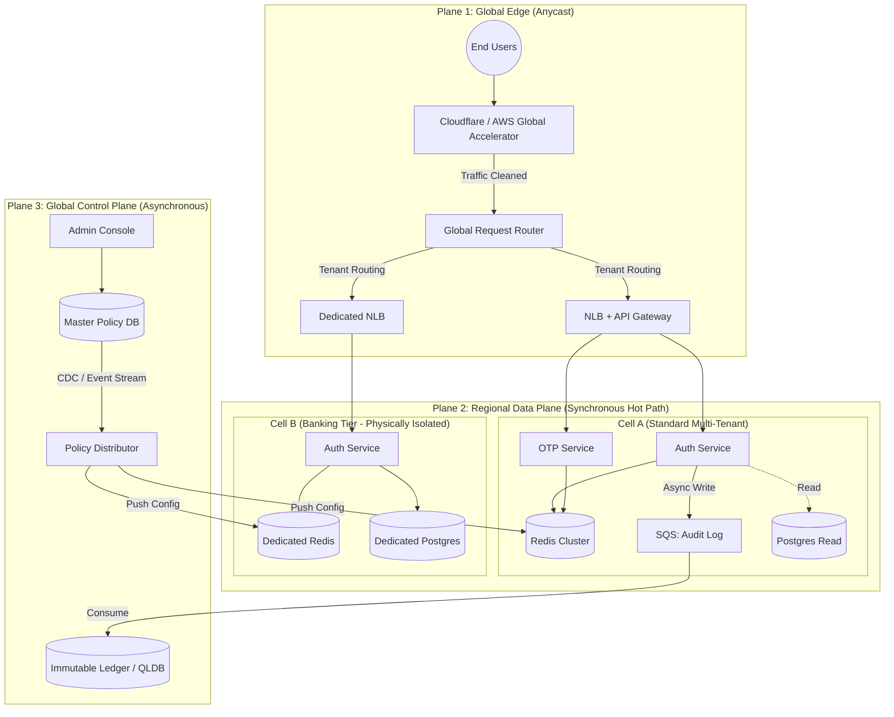

# VaaS Production System Architecture Specification

**Status**: EXECUTION_READY  
**Authority**: VaaS Platform Constitution  
**Enforcement**: Mandatory for all Infrastructure-as-Code (IaC).

---

## 1. High-Level Topology: Cell-Based Architecture

The platform is divided into three distinct planes: **Global Edge** (Ingress), **Regional Data Plane** (Cells), and **Global Control Plane** (Management).

---

## 2. Infrastructure Definitions & Boundaries

### A. Global Edge (Ingress)
*   **Purpose**: DDoS mitigation, TLS termination (edge), Global Rate Limiting.
*   **Components**: Cloudflare Enterprise or AWS Global Accelerator + WAF.
*   **Constraint**: NO direct public IP access to any backend service. All ingress traffic MUST pass through the Edge.
*   **Routing Logic**:
    *   Map `TenantID` -> `CellID` via edge worker (Kv store).
    *   Banking Tier: Dedicated IP ranges.

### B. The "Cell" (Deployment Unit)
A Cell is a self-contained, regionally deployed unit of the VaaS stack.
*   **Components**: 
    1.  **Network Load Balancer (NLB)**: Ingress point.
    2.  **Compute Layer (EKS/Fargate)**: Stateless microservices (Auth, Spatial, OTP).
    3.  **Data Layer (Hot)**: Redis Cluster (Multi-AZ).
    4.  **Data Layer (Cold)**: PostgreSQL (Regional RDS).
*   **Isolation**:
    *   **Standard Cell**: Shared compute, logical database sharding (`tenant_id`).
    *   **Banking Cell**: Dedicated VPC, dedicated Compute, dedicated Database instance.
*   **Failure Containment**: A crash in `Cell 01` DOES NOT affect `Cell 02`.

### C. Network Boundaries (VPC Design)
Per Region / Cell:

| Subnet Class | Access | Components | Security Group Rules |
| :--- | :--- | :--- | :--- |
| **Public (DMZ)** | Internet (via IGW) | NAT Gateway, ALBs (Strict) | In: 443 (Edge IPs Only). Out: 0.0.0.0/0. |
| **App (Private)** | Internal Only | API Gateway, Microservices | In: 443 (From DMZ). Out: Data Layer. |
| **Data (Private)** | No Internet | Redis, Postgres Read Replicas | In: 5432/6379 (From App). No Egress. |
| **Secure (Core)** | No Internet | HMS (CloudHSM), Vault | In: mTLS (From specific App roles). |

---

## 3. Trust Boundaries & Identity

### Boundary A: The Edge (TLS Termination)
*   **Action**: Terminate Public TLS.
*   **Assertion**: Validate Client Hello (JA3 Fingerprint) and rudimentary WAF checks.
*   **Output**: Forward to Cell with `X-Forwarded-For` and `CF-Ray-ID`.

### Boundary B: Cell Ingress (Gateway)
*   **Action**: Rate Limiting (Token Bucket), Authentication (Validate Bearer Token).
*   **Assertion**: Identity Assertion. Check `sk_live` or `JWT` signature.
*   **Output**: Inject `X-Tenant-Context` headers for downstream services.

### Boundary C: Service Mesh (mTLS)
*   **Action**: Service-to-Service communication.
*   **Protocol**: gRPC / HTTP2 over mTLS (SPIFFE/Linkerd).
*   **Assertion**: "OTP Service" is allowed to talk to "Redis", but NOT "Postgres Master".
*   **Constraint**: Zero Trust. No implicit trust based on IP.

---

## 4. Failure Containment Rules

1.  **Region Failure**: 
    *   *Result*: Service Down for that region. 
    *   *Auto-Failover*: **DISABLED** for Banking Tier (Data Residency laws usually forbid automatic geo-failover). **ENABLED** (DNS Shift) for Standard Tier if permissible.
2.  **Cell Failure (Software Bug)**:
    *   *Result*: Only tenants pinned to that Cell are affected. Other Cells operate normally.
3.  **Database Failure**:
    *   *Result*: **Fail Closed**. API returns `503`.
    *   *Constraint*: Do NOT fallback to a cache for *writes*. Ledger integrity is paramount.
4.  **Redis Failure**:
    *   *Result*: **Fail Closed** for Auth/OTP (Hot Path).
    *   * Rationale*: We cannot risk replaying OTPs or allowing revoked tokens because the cache is empty.

---

## 5. Hot Path Analysis (< 3 Hops)

**Scenario**: Verify OTP (POST /verify)

1.  **Hop 1 (Ingress)**: Edge -> **API Gateway**. (Validates Structure, Rate Limit).
2.  **Hop 2 (Compute)**: Gateway -> **OTP Service**. (Business Logic, Hash Check).
3.  **Hop 3 (Data)**: OTP Service -> **Redis**. (Fetch active code, Atomic Compare-and-Delete).
4.  **Return**: 200 OK.
5.  **Side-Effect (Async)**: OTP Service -> SQS -> Audit Log (Postgres).

*Result*: 3 Hops Synchronous. Compliant.

---

## 6. Security Posture Defaults

*   **Encryption at Rest**: AES-256 (AWS KMS) for all Disks and S3 Buckets.
*   **Encryption in Transit**: TLS 1.3 (Public), mTLS (Internal).
*   **Database Access**: NO humans allowed. Only IaC / Migration runners with temporary credentials.
*   **Secrets**: Injected at runtime via Vault agent. Environment variables are scrubbed.

