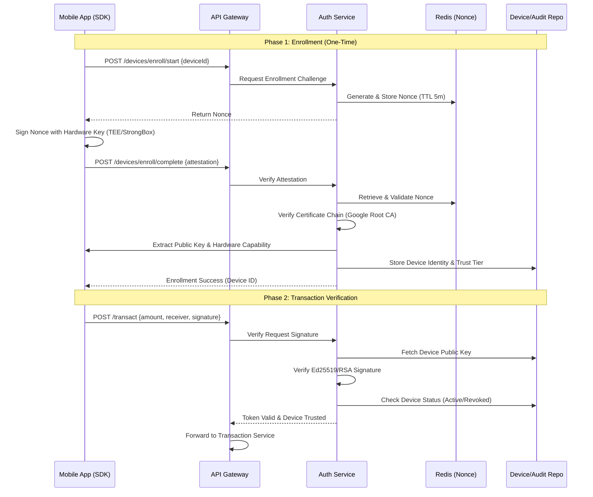
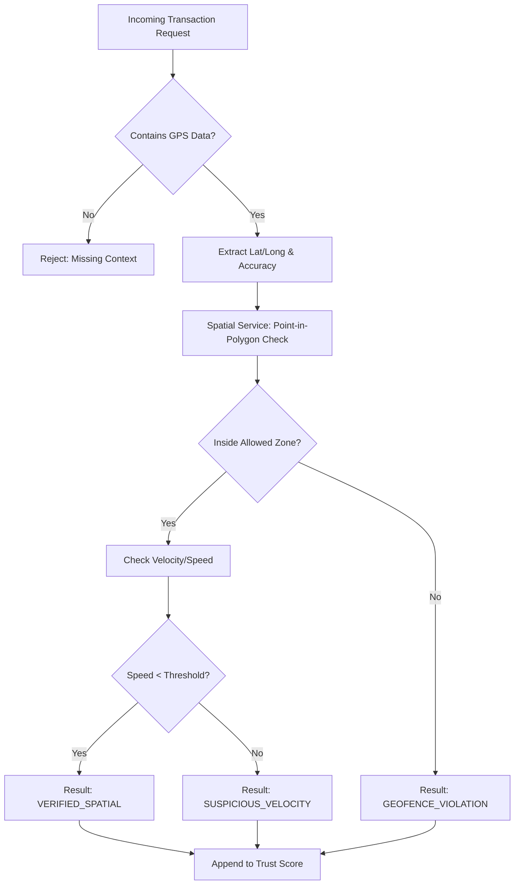
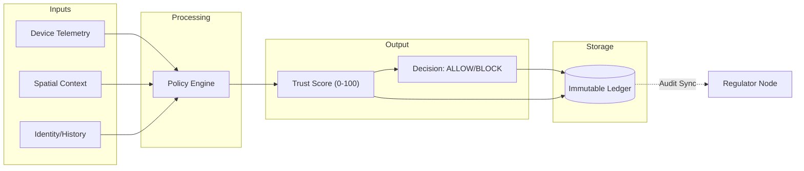
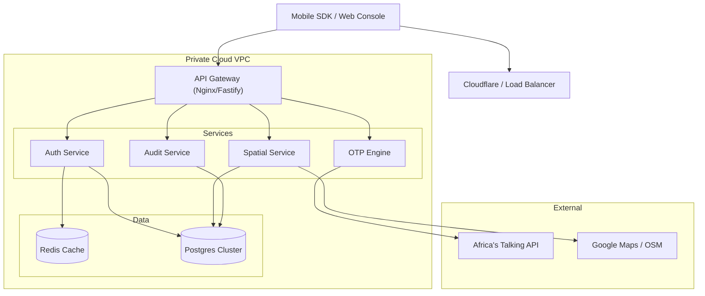
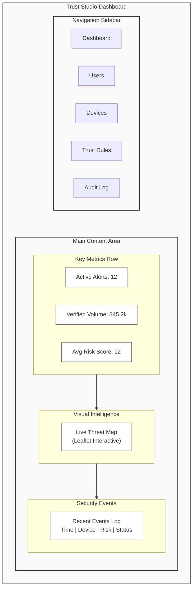
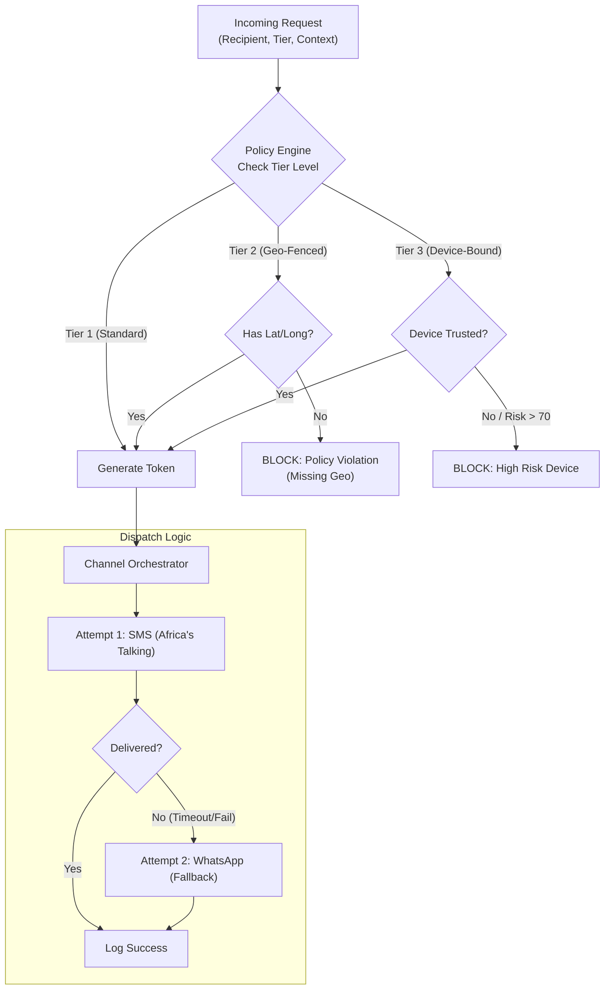

# Vaas System Architecture & Visuals

## 1. Device-Bound Authentication Workflow
This sequence details how a mobile device proves its hardware integrity to the Vaas platform using a nonce-based challenge-response mechanism.

## 2. Spatial Verification Flow
Logic flow for determining if a user is operating within a trusted geofence.

## 3. Transaction Scoring & Immutable Ledger
How disparate data points are aggregated into a single Trust Score and permanently recorded.

## 4. Cloud Infrastructure & OTP Integration
Deployment architecture on AWS/GCP and integration with Telco providers.

## 5. Trust Studio UI Concept (Wireframe)
Layout for the "Trust Studio" dashboard where operators manage risk.

## 6. OTP Service Internal Architecture
The OTP Service functions as a Policy Enforcement Point before dispatching messages.

